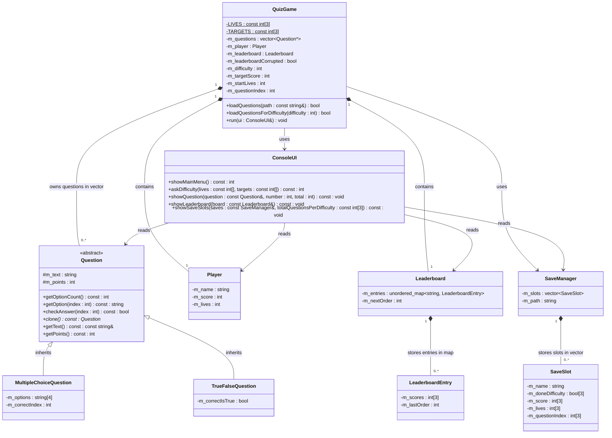

<div align="center">

# Quiz Arena

### A terminal-based quiz game built with C++ and object oriented programming


**Quiz Arena** challenges players with multiple-choice and true/false questions across three difficulty levels. The game includes persistent saves, score tracking, a multi-mode leaderboard, and a polymorphic question system.

[Source Code](./QuizArena/) · [Build and Run](#build-and-run) · [UML Diagram](./md%20Files/uml_diagram.md) · [Presentation](./Presentation/) · [Project Brief](./OOP_Final_Project.pdf) · [Error Handling](#error-handling)

</div>

---

## Table of Contents

- [About the Project](#about-the-project)
- [Main Features](#main-features)
- [How the Game Works](#how-the-game-works)
- [Difficulty Levels](#difficulty-levels)
- [Object-Oriented Design](#object-oriented-design)
- [Class Diagram](#class-diagram)
- [Save System](#save-system)
- [Leaderboard](#leaderboard)
- [Error Handling](#error-handling)
- [Build and Run](#build-and-run)
- [Repository Structure](#repository-structure)
- [Data File Formats](#data-file-formats)
- [Development Process](#development-process)
- [Development Process Gallery](#development-process-gallery)
- [Project Documentation](#project-documentation)

---

## About the Project

Quiz Arena was developed as the final project for the **Object Oriented Programming course** at Braude College of Engineering.

The goal was to create a complete and playable terminal game while demonstrating the main concepts studied in the course:

- Abstract classes and pure virtual methods
- Inheritance and runtime polymorphism
- Encapsulation and const-correctness
- Separation between game logic, user interface, and data
- Manual memory management
- The Rule of Three and deep copying
- Constructor initializer lists for member initialization
- STL containers selected according to access patterns
- File-based save, load, and leaderboard persistence
- Defensive checks for null pointers and corrupted persistent files

---

## Main Features

| Feature | Implementation |
|---|---|
| Question types | Multiple-choice and true/false |
| Game modes | Easy, Normal, and Hard |
| Scoring | Correct answer adds 5 points |
| Lives | Wrong answer removes one life |
| Save system | Separate progress for each difficulty under one player name |
| Load system | Continue saved progress or start a new run |
| Leaderboard | Best score per mode plus total score |
| Persistence | Questions, saves, and leaderboard stored in text files |
| Error handling | Corrupted `saves.txt` / `leaderboard.txt` show an error and block play until fixed |
| Interface | Fully terminal-based menu system |
| Architecture | Logic, UI, data, saves, and leaderboard separated into classes |

---

## How the Game Works

From the main menu, the player can:

1. Start a new game
2. View, load, or delete saved games
3. View the leaderboard
4. Quit

During a quiz round:

- Enter the number of the selected answer.
- Enter `0` to save the current progress and return to the main menu.
- A correct answer adds **5 points**.
- A wrong answer removes **one life** and reveals the correct answer.
- The game ends when all questions are completed or the player runs out of lives.

### Win and Lose Conditions

| Result | Condition |
|---|---|
| **Win** | Complete the question set while alive and reach the target score |
| **Lose** | Run out of lives before completing all questions, or complete all questions without reaching the target score |

---

## Difficulty Levels

| Difficulty | Starting Lives | Target Score |
|---|---:|---:|
| Easy | 5 | 85 |
| Normal | 4 | 90 |
| Hard | 3 | 95 |

Each difficulty has independent save progress and an independent best score on the leaderboard.

---

## Object Oriented Design

The central hierarchy is based on the abstract `Question` class.

```cpp
class Question {
public:
    virtual ~Question();
    virtual int getOptionCount() const = 0;
    virtual string getOption(int index) const = 0;
    virtual bool checkAnswer(int index) const = 0;
    virtual Question* clone() const = 0;
};
```

`MultipleChoiceQuestion` and `TrueFalseQuestion` implement the same interface differently. Both types are stored together in:

```cpp
vector<Question*> m_questions;
```

Virtual methods are called through `Question*`, allowing the game to work with different question types without depending on their concrete classes.

### Key Design Decisions

| Decision | Reason |
|---|---|
| `vector<Question*>` | Questions are loaded in order and accessed by index |
| `vector<SaveSlot>` | Saves are displayed and selected by menu position |
| `unordered_map<string, LeaderboardEntry>` | Leaderboard entries are searched and updated by player name |
| `ConsoleUI` handles all input/output | Keeps display code separate from game rules |
| `QuizGame` owns question objects | Creates one clear owner responsible for allocation and deletion |
| Virtual `clone()` | Allows deep copying of polymorphic question objects |
| Rule of Three in `QuizGame` | Prevents leaks, shared ownership, and double deletion |
| Constructor initializer lists | Members are initialized directly where possible (course style) |
| `nullptr` checks on array parameters | Public APIs that receive arrays (for example question options) reject null pointers safely |
| `bool` for expected failures | Save and file failures are handled without unnecessary exceptions |
| Leaderboard corruption flag | Distinguishes a failed load from a truly empty leaderboard |

---

## Class Diagram



The complete UML diagram and relationship explanations are available in [`md Files/uml_diagram.md`](./md%20Files/uml_diagram.md).

---

## Save System

Each player name represents one save slot. That slot contains separate progress for:

- Easy
- Normal
- Hard

A mode that has never been played is displayed as `X`.

### Save Flow

- A new game requires a unique player name.
- Pressing `0` during a question saves under the current player name.
- Saving updates only the selected difficulty.
- Finishing a game does not delete the save.
- Saved games can be deleted only through the saved-games menu.
- When loading, the player selects a difficulty and then chooses between continuing or starting a new run.
- If `saves.txt` is corrupted, the game shows an error and does not start a new game or open the saved-games flow until the file is fixed.

---

## Leaderboard

The leaderboard stores one entry per player name using:

```cpp
unordered_map<string, LeaderboardEntry>
```

For every player who wins at least one game, it records:

- Best Easy score
- Best Normal score
- Best Hard score
- Total score across all played modes

Rows are sorted by total score from highest to lowest. When two players have the same total, the player who played most recently is shown first.

When loading from file, `m_nextOrder` is set to the maximum saved play order so the next win gets a new order value that does not collide with history.

If `leaderboard.txt` is corrupted, viewing the leaderboard shows an error. Starting a new game or loading a save to play is also blocked until the file is fixed. Deleting a save is still allowed.

---

## Error Handling

> **Persistent files**
>
> The game reads and writes two text files next to the executable:
>
> - `saves.txt` — player save slots (see [Save file format](#data-file-formats))
> - `leaderboard.txt` — best scores per player (see [Leaderboard file format](#data-file-formats))
>
> A **missing** file on first run is normal: the game starts with no saves / an empty leaderboard.
>
> If either file **exists but is corrupted or incomplete**, the game prints an error such as:
> - `ERROR: Save data is corrupted.`
> - `ERROR: Leaderboard data is corrupted.`
>
> In that case you should **quit the game**, fix or replace the broken file (or delete it to start fresh), and **run the game again**. New game and load-to-play stay blocked while the leaderboard file is known to be corrupted, so a broken file is not silently treated as “empty.”

---

## Build and Run

Before running the game, make sure the following are installed:

- MSYS2 in the default folder: `C:\msys64`
- The UCRT64 C++ compiler (`g++`)

To build and run the game:

1. Open the [`QuizArena`](./QuizArena/) folder.
2. Run `run.bat`.
3. The script will compile all source files and start the game automatically.

The game loads the question bank that matches the selected difficulty:

- `questions_easy.txt`
- `questions_normal.txt`
- `questions_hard.txt`

The following files are created or updated while the game is running:

- `saves.txt`
- `leaderboard.txt`

---

## Repository Structure

```text
Oop-Final-Project/
├── .cursor/                  # Cursor project rules and development constraints
├── md Files/
│   ├── prompt_log.md         # Prompts, responses, and accepted/rejected decisions
│   ├── report.md             # Reflection report
│   └── uml_diagram.md        # Full UML diagram and relationship explanations
├── PicturesOfProcess/        # Screenshots documenting the development process
├── Presentation/             # Final presentation files
├── QuizArena/                # C++ source code and game data files
├── OOP_Final_Project.pdf     # Official assignment brief
└── README.md                 # Project overview
```

### Main Source Components

| Component | Responsibility |
|---|---|
| `Question` | Abstract base class for all question types |
| `MultipleChoiceQuestion` | Four-option question implementation |
| `TrueFalseQuestion` | True/false question implementation |
| `Player` | Player name, score, and lives |
| `LeaderboardEntry` | One player's best scores and last-play order |
| `Leaderboard` | Lookup, update, sorting, and file persistence |
| `SaveSlot` | One player's save data for all three modes |
| `SaveManager` | Save loading, storage, update, listing, and deletion |
| `QuizGame` | Game controller, rules, turn loop, and session flow |
| `ConsoleUI` | All console input and output |
| `main.cpp` | Program entry point and object setup |

---

## Data File Formats

<details>
<summary><strong>Question bank format</strong></summary>

### Multiple-choice question

```text
MC
question text
option 1
option 2
option 3
option 4
correct answer index (1-4)
```

### True/false question

```text
TF
question text
correct answer (1 = True, 2 = False)
```

Blank lines and lines beginning with `#` are ignored.

</details>

<details>
<summary><strong>Save file format</strong></summary>

```text
SAVE
player name
EASY 1 score lives questionIndex
NORMAL 0
HARD 0
END
```

Each difficulty is stored on a single line.  
`1` is followed by the score, remaining lives, and current question index.  
`0` means that difficulty has no saved progress.

</details>

<details>
<summary><strong>Leaderboard file format</strong></summary>

```text
ENTRY
player name
lastPlayOrder easyScore normalScore hardScore
END
```

A score of `-1` means that the player has not yet played that mode.

</details>

---

## Development Process

The project was developed with guidance from the instructor-approved Cursor tool. Cursor was used as an advisor and development assistant, not as an autonomous code generator.

Every suggestion was reviewed before being accepted. Proposed changes were checked against the assignment requirements and the C++ conventions used in the course, and were accepted, modified, or rejected according to our own design decisions.

A dedicated rules file was maintained inside the `.cursor` folder to prevent unsupported language features, preserve the required coding style, and document constraints discovered during development.

---

## Development Process Gallery

The following screenshots show several important stages of the development process: planning before implementation, reviewing Cursor's suggestions, rejecting unsuitable design choices, and comparing technical alternatives.

### Planning the Abstract Question Hierarchy

<p align="center">
  
</p>

The abstract `Question` interface was planned before implementation, including its pure virtual methods and relationship with the derived question types.

### Reviewing and Correcting a Cursor Suggestion

<p align="center">
  
</p>

Cursor suggested adding a `display()` method with `cout` inside `Question`.

<p align="center">
  
</p>

The suggestion was rejected because all input and output belong in `ConsoleUI`, while `Question` remains responsible only for data and polymorphic behavior.

### Planning the Main Game Controller

<p align="center">
  
</p>

The `QuizGame` plan defines the main menu flow, question loading, the play session, and the separation between game rules and user interaction.

### Choosing the Leaderboard Container

<p align="center">
  
</p>

The leaderboard design compared `vector` with `unordered_map`. The final choice was `unordered_map<string, LeaderboardEntry>` because entries are searched and updated by player name.

### Planning the Difficulty System

<p align="center">
  
</p>

The difficulty system was planned with separate starting lives and target scores for Easy, Normal, and Hard modes.

Additional screenshots are available in [`PicturesOfProcess`](./PicturesOfProcess/).

---

## Project Documentation

| Document | Content |
|---|---|
| [Official Project Brief](./OOP_Final_Project.pdf) | Original assignment requirements |
| [Prompt Log](./md%20Files/prompt_log.md) | Development prompts, agent summaries, and decisions |
| [Reflection Report](./md%20Files/report.md) | Reflection on the development process and agent usage |
| [UML Diagram](./md%20Files/uml_diagram.md) | Full class diagram and relationship explanations |
| [Presentation](./Presentation/) | Slides used for the final presentation |
| [Development Screenshots](./PicturesOfProcess/) | Visual documentation of the process |
| [Source Code](./QuizArena/) | Complete C++ project files |

---

<div align="center">

### Quiz Arena

**C++ · Object Oriented Programming · Terminal Game · File Persistence**

</div>
