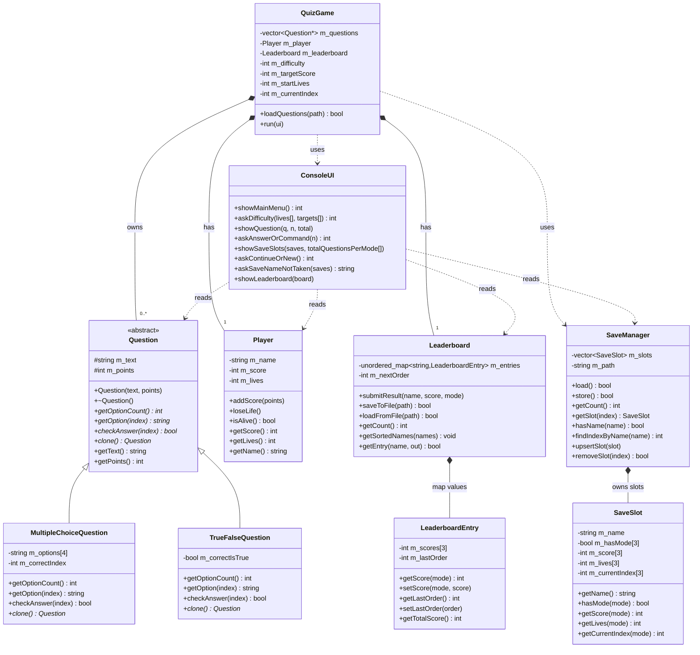

# UML Class Diagram — Quiz Arena

This file documents the class structure for the presentation and report. It includes a
Mermaid diagram (renders on GitHub and in many Markdown viewers), an ASCII fallback you can
copy onto a slide or redraw by hand, and a written description of every relationship.

---

## Mermaid Class Diagram



---

## ASCII Fallback

```
                         +------------------------+
                         |      Question          |  <<abstract>>
                         |------------------------|
                         | # m_text : string      |
                         | # m_points : int       |
                         |------------------------|
                         | + getOptionCount()* int|
                         | + getOption(i)*  string|
                         | + checkAnswer(i)* bool |
                         | + clone()*    Question*|
                         | + getText()      string|
                         | + getPoints()       int|
                         +------------------------+
                                   /_\
                                    |  (inheritance)
                 +------------------+------------------+
                 |                                     |
   +---------------------------+        +---------------------------+
   | MultipleChoiceQuestion    |        | TrueFalseQuestion         |
   |---------------------------|        |---------------------------|
   | - m_options[4] : string   |        | - m_correctIsTrue : bool  |
   | - m_correctIndex : int    |        |                           |
   +---------------------------+        +---------------------------+

   +-------------------------------------------------------------+
   |                          QuizGame                           |
   |-------------------------------------------------------------|
   | - m_questions : vector<Question*>   (owns the objects)      |
   | - m_player : Player              (composition)              |
   | - m_leaderboard : Leaderboard    (composition)              |
   | - m_difficulty / m_targetScore / m_startLives : int         |
   | - m_currentIndex : int                                      |
   |-------------------------------------------------------------|
   | + loadQuestions(path) bool     + run(ui)                    |
   +-------------------------------------------------------------+
      | owns 0..*     | has 1        | has 1        \ uses      \ uses
      v               v              v               v            v
 [ Question* ]    [ Player ]   [ Leaderboard ]  [ SaveManager ] [ ConsoleUI ]
                   name/score/    unordered_map    vector           all I/O
                   lives          <string,Entry>   <SaveSlot>
                                  per-mode scores
```

---

## Relationship Descriptions

| Relationship | Type | Meaning |
|--------------|------|---------|
| `MultipleChoiceQuestion` → `Question` | Inheritance | "is-a" question |
| `TrueFalseQuestion` → `Question` | Inheritance | "is-a" question |
| `QuizGame` → `Question` | Aggregation/ownership | Owns a `vector<Question*>`; deletes the objects in its destructor |
| `QuizGame` → `Player` | Composition | Player is a member, lives and dies with the game |
| `QuizGame` → `Leaderboard` | Composition | Leaderboard is a member of the game |
| `QuizGame` → `SaveManager` | Dependency (uses) | Creates one locally to list/load/delete/upsert saved games |
| `QuizGame` → `ConsoleUI` | Dependency (uses) | Passed a `ConsoleUI&` to talk to the user |
| `Leaderboard` → `LeaderboardEntry` | Composition | Map values, one entry per player name |
| `SaveManager` → `SaveSlot` | Composition | Vector of slots, one per player name |
| `ConsoleUI` → `Question`/`Player`/`Leaderboard`/`SaveManager` | Dependency (reads) | Reads their data to display it, never owns them |

---

## Where Each Required OOP Concept Appears

| Requirement | Where in the diagram |
|-------------|----------------------|
| Abstract base class + pure virtual | `Question` (starred methods) |
| Inheritance | `MultipleChoiceQuestion`, `TrueFalseQuestion` |
| Polymorphism (container of base pointers) | `QuizGame::m_questions` = `vector<Question*>`, virtual calls in the turn loop |
| Null pointer safety | `nullptr` checks before `delete`, `clone`, `addQuestion`, and using `current` in the turn loop |
| Encapsulation | all members `-`/`#` (private/protected); `LeaderboardEntry` and `SaveSlot` are classes |
| Separation of concerns | logic in `QuizGame`, I/O in `ConsoleUI`, saves in `SaveManager`, data in entities |
| No global variables | all state inside `QuizGame`/`Player` |
| STL containers (not always vector) | `vector<Question*>`, `vector<SaveSlot>`, `unordered_map<string, LeaderboardEntry>` |
| Rule of Three | `QuizGame` destructor, copy ctor, assignment (deep copy via `clone()`) |

---

## Notes for Drawing the Diagram on a Slide

- Put `Question` at the top with the two derived classes beneath it (the inheritance triangle).
- Put `QuizGame` in the centre as the hub; draw arrows to `Player`, `Leaderboard`, the
  `vector<Question*>`, `SaveManager`, and `ConsoleUI`.
- `Leaderboard` holds an `unordered_map<string, LeaderboardEntry>`; show `LeaderboardEntry` as its
  value type (scores per mode + last-order counter). There is no separate display-row class.
- Show `SaveSlot` inside `SaveManager` — a class with per-mode arrays.
- Mark `getOptionCount`, `getOption`, `checkAnswer`, and `clone` as pure virtual (italic or a
  trailing `*`) — that is the single most important thing the instructor will look for.
- There is **no timer** in the final design — do not draw time fields on `QuizGame` or
  `Leaderboard`.
