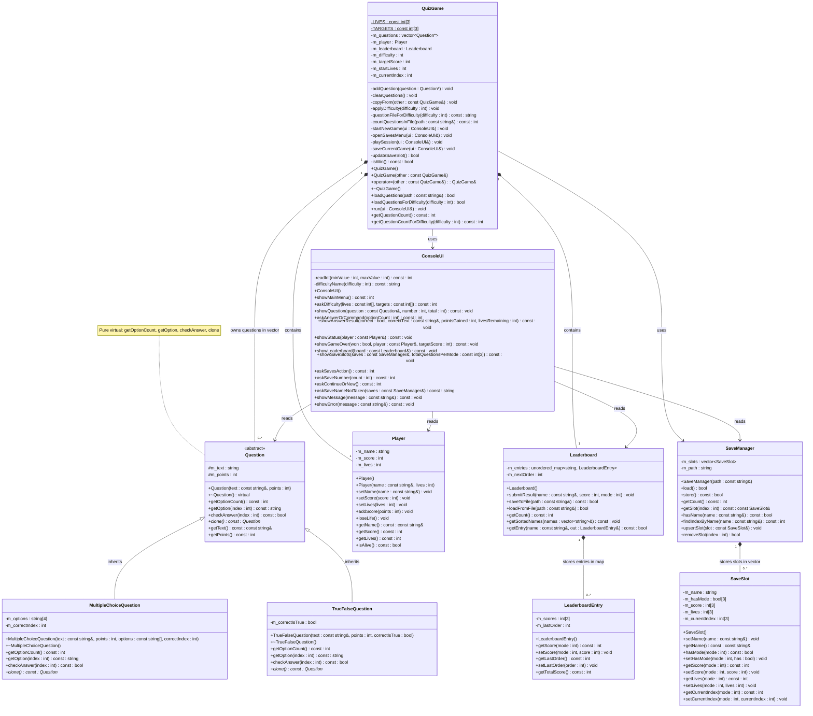

# UML Class Diagram — Quiz Arena

This file documents the current class structure of **Quiz Arena** according to the latest
`.h` and `.cpp` files.

---

## Mermaid Class Diagram



---

## ASCII Fallback

```text
                         +------------------------+
                         |       Question         |  <<abstract>>
                         |------------------------|
                         | # m_text : string      |
                         | # m_points : int       |
                         |------------------------|
                         | + getOptionCount() = 0 |
                         | + getOption(i) = 0     |
                         | + checkAnswer(i) = 0   |
                         | + clone() = 0          |
                         +------------------------+
                                   /_\
                                    |  inheritance
                 +------------------+------------------+
                 |                                     |
   +---------------------------+        +---------------------------+
   | MultipleChoiceQuestion    |        | TrueFalseQuestion         |
   |---------------------------|        |---------------------------|
   | - m_options[4] : string   |        | - m_correctIsTrue : bool  |
   | - m_correctIndex : int    |        |                           |
   +---------------------------+        +---------------------------+

   +---------------------------------------------------------------+
   |                           QuizGame                            |
   |---------------------------------------------------------------|
   | - LIVES[3] / TARGETS[3] : static const int                   |
   | - m_questions : vector<Question*>                            |
   | - m_player : Player                                          |
   | - m_leaderboard : Leaderboard                                |
   | - m_difficulty / m_targetScore / m_startLives : int          |
   | - m_currentIndex : int                                       |
   |---------------------------------------------------------------|
   | + loadQuestions(path)                                        |
   | + loadQuestionsForDifficulty(difficulty)                     |
   | + run(ui)                                                    |
   | + getQuestionCount()                                         |
   | + getQuestionCountForDifficulty(difficulty)                  |
   | + copy constructor / assignment / destructor                 |
   +---------------------------------------------------------------+
      | owns 0..*     | contains 1    | contains 1    \ uses
      v               v               v                v
 [ Question* ]    [ Player ]     [ Leaderboard ]  [ SaveManager ]
                                  map<string,Entry> vector<SaveSlot>

                                      [ ConsoleUI ]
                                     all console I/O
```

---

## Relationship Descriptions

| Relationship | Type | Meaning in the current code |
|---|---|---|
| `MultipleChoiceQuestion` → `Question` | Inheritance | A multiple-choice question is a concrete `Question`. |
| `TrueFalseQuestion` → `Question` | Inheritance | A true/false question is a concrete `Question`. |
| `QuizGame` → `Question` | Composition / ownership | Stores `vector<Question*>`, creates/clones the objects and deletes them in `clearQuestions()` and the destructor. |
| `QuizGame` → `Player` | Composition | `m_player` is a value member whose lifetime is tied to the game. |
| `QuizGame` → `Leaderboard` | Composition | `m_leaderboard` is a value member whose lifetime is tied to the game. |
| `Leaderboard` → `LeaderboardEntry` | Composition | Entries are stored directly as values inside `unordered_map<string, LeaderboardEntry>`. |
| `SaveManager` → `SaveSlot` | Composition | Slots are stored directly as values inside `vector<SaveSlot>`. |
| `QuizGame` → `MultipleChoiceQuestion` / `TrueFalseQuestion` | Dependency | `loadQuestions()` creates the concrete question objects. |
| `QuizGame` → `SaveManager` / `SaveSlot` | Dependency | Creates save managers locally and reads or updates save slots. |
| `QuizGame` → `ConsoleUI` | Dependency | Receives `ConsoleUI&` and uses it for all user interaction. |
| `ConsoleUI` → model classes | Dependency | Reads `Question`, `Player`, `Leaderboard`, `LeaderboardEntry`, `SaveManager` and `SaveSlot` data for display; it owns none of them. |

---

## Current Constants Reflected by the Code

| Difficulty | Lives | Target score | Question file |
|---|---:|---:|---|
| Easy | 5 | 85 | `questions_easy.txt` |
| Normal | 4 | 90 | `questions_normal.txt` |
| Hard | 3 | 95 | `questions_hard.txt` |

Both question types currently award **5 points** per correct answer.

---

## Where Each Required OOP Concept Appears

| Requirement | Where in the current code |
|---|---|
| Abstract base class + pure virtual methods | `Question`; `getOptionCount`, `getOption`, `checkAnswer` and `clone` are pure virtual. |
| Inheritance | `MultipleChoiceQuestion` and `TrueFalseQuestion` inherit publicly from `Question`. |
| Polymorphism | `QuizGame::m_questions` is `vector<Question*>`; the game calls virtual methods through base pointers. |
| Dynamic memory ownership | `QuizGame` creates, clones and deletes the `Question` objects. |
| Rule of Three | `QuizGame` has a destructor, copy constructor and assignment operator; copying uses `clone()`. |
| Encapsulation | Data members are private or protected and accessed through methods. |
| Separation of concerns | Game logic in `QuizGame`, console I/O in `ConsoleUI`, saves in `SaveManager`, scores in `Leaderboard`, player state in `Player`. |
| STL containers | `vector<Question*>`, `vector<SaveSlot>` and `unordered_map<string, LeaderboardEntry>`. |
| Null pointer safety | Checks before adding, cloning, deleting and using question pointers. |
| No global game state | Player, score, lives, saves, leaderboard data and question progress are stored inside objects. |

---

## Notes for the Presentation Slide

- Place `Question` above `MultipleChoiceQuestion` and `TrueFalseQuestion` with inheritance arrows pointing to `Question`.
- Place `QuizGame` in the centre as the controller.
- Use filled diamonds from `QuizGame` to `Question`, `Player` and `Leaderboard`.
- Use a filled diamond from `Leaderboard` to `LeaderboardEntry` and from `SaveManager` to `SaveSlot`.
- Use dashed dependency arrows from `QuizGame` to `ConsoleUI` and `SaveManager`.
- Mark the four polymorphic methods in `Question` as pure virtual.
- Do not add a timer; the current design has no timer fields.
